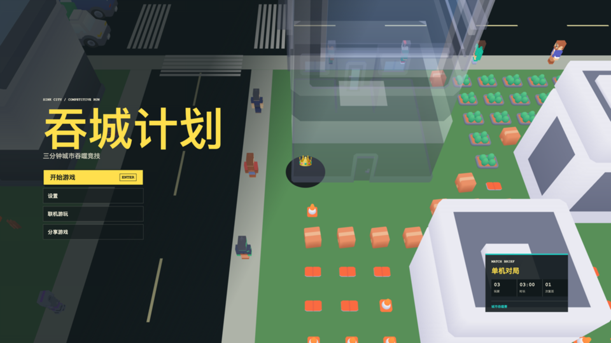

# Hole City

[](./SPEC.md)
[](./tsconfig.base.json)
[](./packages/client/vite.config.ts)
[](./packages/client/package.json)
[](./package.json)

Hole City 是一个 Hole.io 风格的 Web 3D 城市吞噬游戏。当前仓库的主要可玩入口是单机模式：玩家控制黑洞在城市街区中移动，吞噬车辆、建筑、行人和道路物件，并与两个 Bot 竞争分数。

项目采用 pnpm workspace，游戏模拟、客户端渲染和后续联机协议分层维护。当前版本处于 Phase 1：单机核心玩法已经可运行，联机服务仍在开发中。



## 当前状态

- Phase 0：workspace、Vite、Three.js、TypeScript strict、基础输入和跟随摄像机已完成。
- Phase 1：单机权威模拟、城市地图、物理吞噬、Bot、HUD、复活和结算流程已完成。
- Phase 2：地图编辑器尚未实现。
- Phase 3：信令服务和协议骨架已存在，完整 WebRTC 对局流程尚未作为当前默认玩法提供。
- Phase 4/5：存档、商店和完整移动端优化尚未实现。

## 快速开始

### 环境要求

- Node.js 发行版，建议使用当前 LTS
- pnpm `10.x`

### 安装与运行

```bash
pnpm install
pnpm dev
```

开发服务器启动后，打开终端输出的本地地址。`pnpm dev` 只启动客户端，不会启动后端；停止开发时结束对应终端中的进程。

### 常用命令

```bash
pnpm test                 # 运行全部测试
pnpm --filter @hole-io/shared test
pnpm build                # 构建客户端
pnpm typecheck            # 检查所有 workspace 包
pnpm lint                 # oxlint
pnpm format               # oxfmt 格式化
pnpm format:check        # 检查格式
```

客户端和共享模拟可以独立检查：

```bash
pnpm --filter @hole-io/client typecheck
pnpm --filter @hole-io/shared typecheck
```

## GitHub Pages 部署

仓库包含 [`deploy-pages.yml`](./.github/workflows/deploy-pages.yml)，推送到 `main` 后会自动构建并部署 `packages/client` 到 GitHub Pages。也可以在 Actions 页面手动运行该 workflow。

首次使用时，在 GitHub 仓库设置中启用 Pages，并将构建来源设为 **GitHub Actions**。Vite 会在 Actions 环境中自动使用仓库名作为静态资源前缀，适配 `https://<user>.github.io/<repo>/` 形式的项目站点。

GitHub Pages 只托管静态客户端。联机模式仍需要部署独立的 Fastify/WebSocket 服务，并将客户端连接地址配置为 HTTPS 页面可访问的 `wss://` 地址；后端的 `CORS_ORIGIN` 应包含 Pages 站点 origin。WebRTC 建连失败时还需要可用的 STUN/TURN 配置。

## 游戏玩法

- 单局时长：`180s`。
- 初始黑洞半径：`1.15m`。
- 玩家移动：方向键、WASD 或鼠标/指针拖拽。
- 黑洞成长：分数在等级锚点之间连续插值；超过最高锚点后仍按面积比例继续增长。
- 吞噬判定：空间哈希只负责候选筛选；物体必须被洞口完整覆盖，并由地表洞缘承托后通过地面，才会真正下落、消失和计分。
- 物理表现：只有正在被吞噬的物体进入 cannon-es；地下井壁和井底只渲染，不参与碰撞。
- 分值：最高建筑 `commercial-skyscraper-d` 固定 `+50`；其他建筑按占地面积为 `+20` / `+30` / `+40`；车辆 `+40`；小物体按类型为 `+4` / `+12` / `+25`，不通过缩放改变分值。
- 玩家对抗：大洞完全覆盖小洞时可以吞噬对方；每位玩家有一次复活机会，复活保留原积分和尺寸，并获得 `5s` 无敌时间。
- Bot：两个 Bot 使用低速、近距离最近目标策略，不按全图最大收益路线行动。
- 技能：`Q` 提速持续 `5s`、冷却 `15s`；`E` 直接永久提升至下一尺寸等级，激活指示 `10s`、冷却 `25s`；`R` 自爆倒计时 `3s`、冷却 `45s`。

地图当前为 `169m × 220m` 城市，4 条纵向道路和 5 条横向道路形成 `3 × 4` 个净宽 `41m` 的大街区。五类街区每块固定使用 6 种建筑并优先高层，运行时使用 24 种建筑模型；建筑之间保留 `0.2m` 间隙。场景共 `695` 个物体：157 栋建筑、44 辆车辆、155 名行人（11 名移动）和 339 个三档分值小物体（`+4 × 150`、`+12 × 142`、`+25 × 47`）。初始布局、车辆路线和吞噬中的活跃刚体均禁止重叠与穿模。

客户端分为首页 `#/`、游戏页 `#/game` 和静态结算页 `#/results`。Three.js、物理和 GLB 模型只在进入游戏页后懒加载；静态模型继续按 prefab 实例化，模型加载限制为 4 路并发，渲染像素比上限为 `1.25`。

## 操作

### 对局中

- `ArrowUp` / `ArrowDown` / `ArrowLeft` / `ArrowRight` 或 `WASD`：移动。
- 鼠标或指针拖拽：控制移动方向。
- `Q`：移速提升；`E`：永久提升至下一尺寸等级；`R`：启动自爆倒计时。
- `Ctrl+R` / `Command+R`：保留浏览器原生刷新行为。
- 点击 HUD 中的“主页”：返回开局菜单并开始一局新的随机出生位置。
- `R`：结算页面重新开始。

结算页面也可以点击“返回主页”回到开局菜单。

### 菜单与弹窗

- 方向键：在菜单按钮之间移动当前项。
- `Enter` 或小键盘 `Enter`：触发当前按钮。
- 弹窗确认：`Enter`。
- 弹窗取消：`Esc`。

移动端不显示键盘提示，使用触摸拖拽控制移动，画布显示跟手虚拟摇杆。

## 技术架构

```text
packages/
  client/    Vite + React 路由/UI + Three.js，输入、场景、模型、HUD、首页和结算页
  shared/    纯 TypeScript 模拟、预制件定义、协议类型和测试
  server/    Fastify 信令服务骨架，当前不承载游戏逻辑
assets/
  kits/      Kenney 城市、车辆和人物素材
docs/        Phase 笔记和素材清单
```

核心约束：

- `packages/shared/simulation` 不依赖 `window`、`document`、WebRTC 或 Node API。
- 单机模式由本地权威循环调用共享模拟；客户端只负责输入采集和渲染。
- 联机模式的输入包不携带位置或分数，状态由 host 计算并广播。
- `packages/shared/protocol` 是客户端和服务端共享的协议类型唯一来源。
- 静态地图物体不创建 Cannon 刚体，只有活跃吞噬物体进入物理模拟。
- TypeScript 使用 strict 模式；修改玩法、协议或界面流程时必须同步更新 `SPEC.md`。

## 素材

运行时使用本地 Kenney CC0 素材包：

- Kenney Car Kit
- Kenney City Kit (Suburban)
- Kenney City Kit (Commercial)
- Kenney Blocky Characters 2.0

素材文件位于 [`assets/kits`](./assets/kits)，模型用途、尺寸策略和许可信息见 [`docs/asset-inventory.md`](./docs/asset-inventory.md)。

## 测试覆盖

共享模拟测试覆盖以下关键行为：

- 空间哈希候选查询和无重叠布局。
- 洞口接触、洞缘承托、下落、吞噬和计分时机。
- 洞移开后的物体复位和路线恢复。
- 车辆与行人的定向路线、车辆间距和长期运行边界。
- Bot 目标稳定性、地图边界和实际得分。
- 玩家吞噬、一次复活、无敌时间和第二次出局。
- 技能冷却、炸弹范围、击倒和永久淘汰。
- 全部运行时预制件至少在地图中出现一次。

## 开发文档

- [`AGENTS.md`](./AGENTS.md)：工程规则、目录约定和架构边界。
- [`SPEC.md`](./SPEC.md)：当前需求和玩法参数的唯一真源。
- [`docs/phase-0-notes.md`](./docs/phase-0-notes.md)：Phase 0 实现记录。
- [`docs/phase-1-notes.md`](./docs/phase-1-notes.md)：Phase 1 实现记录和已知问题。
- [`docs/asset-inventory.md`](./docs/asset-inventory.md)：本地模型清单和素材许可。

## 已知限制

- 地图仍由共享模块中的程序化布局代码生成，地图编辑器尚未接入。
- 完整 WebRTC 对局、TURN、存档和数据库不属于当前默认可玩流程。
- Host 权威的联机架构存在结构性信任限制，详见 `AGENTS.md` 第 8 节。
- 移动端专项性能和触控体验优化仍属于后续阶段。
